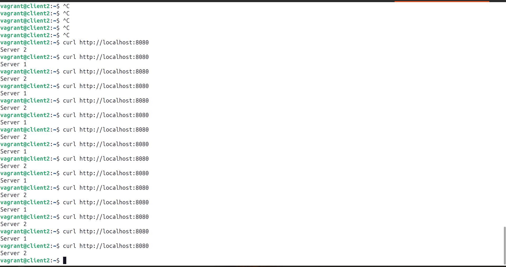
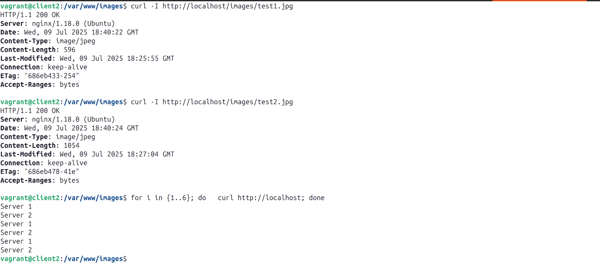

Домашнее задание к занятию 2 «Кластеризация и балансировка нагрузки» Колыванов Антон

### Задание 1
Запустите два simple python сервера на своей виртуальной машине на разных портах
Установите и настройте HAProxy, воспользуйтесь материалами к лекции по ссылке
Настройте балансировку Round-robin на 4 уровне.
На проверку направьте конфигурационный файл haproxy, скриншоты, где видно перенаправление запросов на разные серверы при обращении к HAProxy.

конфигурационный файл haproxy

Перенаправление запросов на разные серверы при обращении к HAProxy

---
### Задание 2

Запустите три simple python сервера на своей виртуальной машине на разных портах
Настройте балансировку Weighted Round Robin на 7 уровне, чтобы первый сервер имел вес 2, второй - 3, а третий - 4
HAproxy должен балансировать только тот http-трафик, который адресован домену example.local
На проверку направьте конфигурационный файл haproxy, скриншоты, где видно перенаправление запросов на разные серверы при обращении к HAProxy c использованием домена example.local и без него.

конфигурационный файл haproxy

перенаправление запросов на разные серверы при обращении к HAProxy c использопользованием домена example.local и без него.

---

### Задание 3*

Настройте связку HAProxy + Nginx как было показано на лекции.
Настройте Nginx так, чтобы файлы .jpg выдавались самим Nginx (предварительно разместите несколько тестовых картинок в директории /var/www/), а остальные запросы переадресовывались на HAProxy, который в свою очередь переадресовывал их на два Simple Python server.
На проверку направьте конфигурационные файлы nginx, HAProxy, скриншоты с запросами jpg картинок и других файлов на Simple Python Server, демонстрирующие корректную настройку.

файл nginx

файл HAProxy

скриншоты с запросами jpg картинок

---

### Задание 4*
